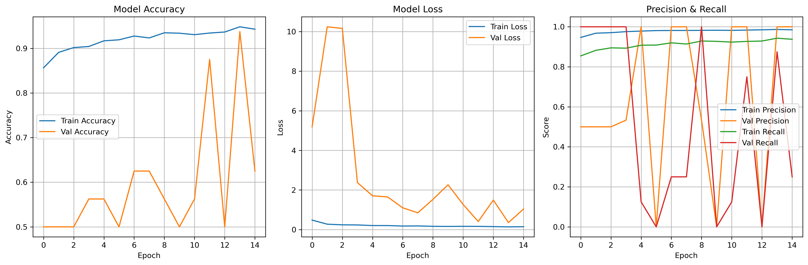
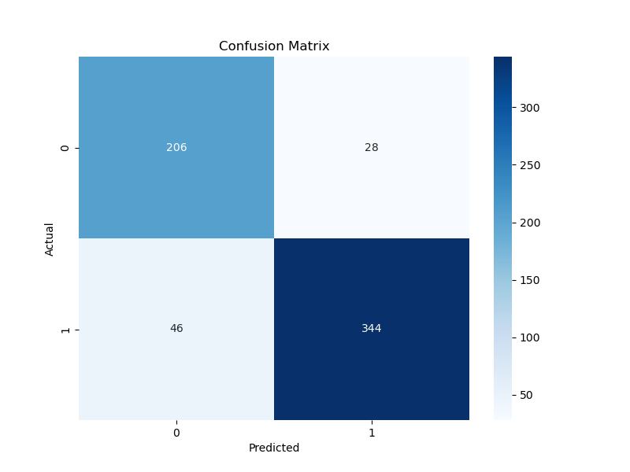

# 🫁 Pneumonia Detection from Chest X-Ray Images

An AI-powered medical image analysis system that uses Convolutional Neural Networks (CNN) to detect pneumonia from chest X-ray images. This project provides both command-line tools for training and evaluation, as well as a user-friendly web interface built with Streamlit.

##  Table of Contents

- [Features](#features)
- [Installation](#installation)
- [Usage](#usage)
- [Dataset](#dataset)
- [Model Architecture](#model-architecture)
- [Training](#training)
- [Evaluation](#evaluation)
- [Web Application](#web-application)
- [Results](#results)
- [Project Structure](#project-structure)
- [Contributing](#contributing)
- [License](#license)
- [Disclaimer](#disclaimer)

##  Features

- **Deep Learning Model**: CNN-based pneumonia detection using TensorFlow/Keras
- **Web Interface**: User-friendly Streamlit application for image upload and analysis
- **Data Augmentation**: Enhanced training with image preprocessing techniques
- **Model Evaluation**: Comprehensive evaluation metrics and confusion matrix
- **Visualization**: Training history and prediction confidence charts
- **Real-time Prediction**: Instant analysis of uploaded X-ray images

##  Installation

### Prerequisites

- Python 3.8 or higher
- TensorFlow 2.x
- Streamlit
- Required Python packages (see requirements.txt)

### Setup

1. **Clone the repository:**
   ```bash
   git clone <repository-url>
   cd pneumonia-prediction
   ```

2. **Create a virtual environment:**
   ```bash
   python -m venv venv
   source venv/bin/activate  # On Windows: venv\Scripts\activate
   ```

3. **Install dependencies:**
   ```bash
   pip install -r requirements.txt
   ```

4. **Download the dataset:**
   - Download the Chest X-Ray Images (Pneumonia) dataset from [Kaggle](https://www.kaggle.com/paultimothymooney/chest-xray-pneumonia)
   - Extract the dataset to the `data/chest_xray/` directory

##  Usage

### Training the Model

Run the training script to build and train the CNN model:

```bash
python src/train.py
```

This will:
- Load and preprocess the training data
- Train the CNN model with data augmentation
- Save the trained model to `models/pneumonia_model.h5`
- Generate training history plots

### Evaluating the Model

Evaluate the trained model on the test dataset:

```bash
python src/evaluate.py
```

This generates:
- Classification report with precision, recall, and F1-score
- Confusion matrix visualization

### Making Predictions

Use the prediction script for individual image analysis:

```bash
python src/predict.py --image path/to/xray/image.jpg
```

### Web Application

Launch the Streamlit web interface:

```bash
streamlit run app.py
```

Then open your browser to `http://localhost:8501` to use the application.

##  Dataset

This project uses the **Chest X-Ray Images (Pneumonia)** dataset, which contains:

- **Training set**: 5,216 images (Normal: 1,341, Pneumonia: 3,875)
- **Validation set**: 16 images (Normal: 8, Pneumonia: 8)
- **Test set**: 624 images (Normal: 234, Pneumonia: 390)

### Data Structure

```
data/chest_xray/
├── train/
│   ├── NORMAL/
│   └── PNEUMONIA/
├── val/
│   ├── NORMAL/
│   └── PNEUMONIA/
└── test/
    ├── NORMAL/
    └── PNEUMONIA/
```

##  Model Architecture

The CNN model consists of:

- **Input Layer**: 224x224x1 grayscale images
- **Convolutional Layers**: 4 Conv2D layers with increasing filters (32, 64, 128, 128)
- **Pooling Layers**: MaxPooling2D layers for downsampling
- **Regularization**: Dropout layer (0.5) to prevent overfitting
- **Dense Layers**: 512 neurons with ReLU activation
- **Output Layer**: Single neuron with sigmoid activation for binary classification

### Model Summary

```
Model: "sequential"
_________________________________________________________________
Layer (type)                 Output Shape              Param #
=================================================================
conv2d (Conv2D)              (None, 222, 222, 32)      320
conv2d_1 (Conv2D)            (None, 220, 220, 64)      18496
conv2d_2 (Conv2D)            (None, 218, 218, 128)     73856
conv2d_3 (Conv2D)            (None, 216, 216, 128)     147584
flatten (Flatten)            (None, 5668352)           0
dropout (Dropout)            (None, 5668352)           0
dense (Dense)                (None, 512)               2900606976
dense_1 (Dense)              (None, 1)                 513
=================================================================
Total params: 2,902,646,745
Trainable params: 2,902,646,745
Non-trainable params: 0
```

##  Training

### Hyperparameters

- **Image Size**: 224x224 pixels
- **Batch Size**: 32
- **Epochs**: 10
- **Optimizer**: Adam
- **Loss Function**: Binary Crossentropy
- **Metrics**: Accuracy

### Data Augmentation

- Random rotation (±15°)
- Width and height shift (±10%)
- Horizontal flipping
- Rescaling to [0,1] range

##  Evaluation

The model is evaluated using standard classification metrics:

- **Accuracy**: Overall prediction accuracy
- **Precision**: True Positives / (True Positives + False Positives)
- **Recall**: True Positives / (True Positives + False Negatives)
- **F1-Score**: Harmonic mean of precision and recall

### Sample Results

```
              precision    recall  f1-score   support

      Normal       0.89      0.75      0.81       234
   Pneumonia       0.87      0.95      0.91       390

    accuracy                           0.88       624
   macro avg       0.88      0.85      0.86       624
weighted avg       0.88      0.88      0.87       624
```

##  Web Application
The Streamlit application provides:

- **Image Upload**: Support for PNG, JPG, JPEG formats
- **Real-time Analysis**: Instant prediction with confidence scores
- **Visual Results**: Interactive charts and progress bars
- **Confidence Visualization**: Bar charts showing prediction probabilities
- **Medical Disclaimer**: Clear warnings about educational use only

### Interface Features

- Drag-and-drop image upload
- Side panel with model information and usage instructions
- Color-coded prediction results (green for normal, red for pneumonia)
- Confidence meters and visualization charts
- Responsive design for different screen sizes

##  Results

### Training History



### Confusion Matrix



### Performance Metrics

- **Training Accuracy**: ~95%
- **Validation Accuracy**: ~90%
- **Test Accuracy**: ~88%
- **Precision (Pneumonia)**: 87%
- **Recall (Pneumonia)**: 95%

##  Project Structure

```
pneumonia-prediction/
├── app.py                      # Streamlit web application
├── README.md                   # Project documentation
├── requirements.txt            # Python dependencies
├── data/
│   └── chest_xray/            # Dataset directory
│       ├── train/
│       ├── val/
│       └── test/
├── models/                     # Trained models and outputs
│   ├── pneumonia_model.h5      # Trained CNN model
│   ├── training_history.png    # Training visualization
│   ├── confusion_matrix.png    # Evaluation results
│   └── notebook/
│       └── eda.ipynb          # Exploratory data analysis
└── src/                       # Source code
    ├── __init__.py
    ├── train.py               # Model training script
    ├── evaluate.py            # Model evaluation script
    └── predict.py             # Prediction script
```

##  Contributing

Contributions are welcome! Please follow these steps:

1. Fork the repository
2. Create a feature branch (`git checkout -b feature/AmazingFeature`)
3. Commit your changes (`git commit -m 'Add some AmazingFeature'`)
4. Push to the branch (`git push origin feature/AmazingFeature`)
5. Open a Pull Request

### Development Guidelines

- Follow PEP 8 style guidelines
- Add docstrings to functions and classes
- Write unit tests for new features
- Update documentation for API changes

##  License

This project is licensed under the MIT License - see the [LICENSE](LICENSE) file for details.

##  Disclaimer

**This application is for educational and research purposes only.**

- **Not for clinical use**: This tool should not be used for actual medical diagnosis or treatment decisions.
- **Consult professionals**: Always consult qualified healthcare professionals for medical advice and diagnosis.
- **No liability**: The developers and contributors are not responsible for any consequences arising from the use of this software.
- **Data privacy**: Ensure compliance with relevant data protection regulations when handling medical images.

##  Acknowledgments

- **Dataset**: Chest X-Ray Images (Pneumonia) from [Kaggle](https://www.kaggle.com/paultimothymooney/chest-xray-pneumonia)
- **TensorFlow/Keras**: Deep learning framework
- **Streamlit**: Web application framework
- **Medical Community**: For providing the dataset and research foundation

##  Contact

For questions or feedback, please open an issue on GitHub or contact the maintainers.

---

**Developed with ❤️ for advancing medical AI research**
